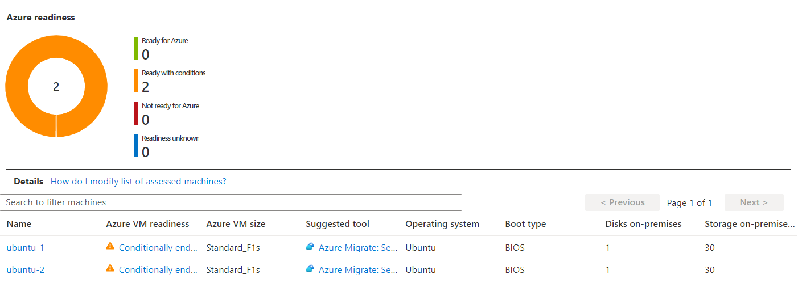
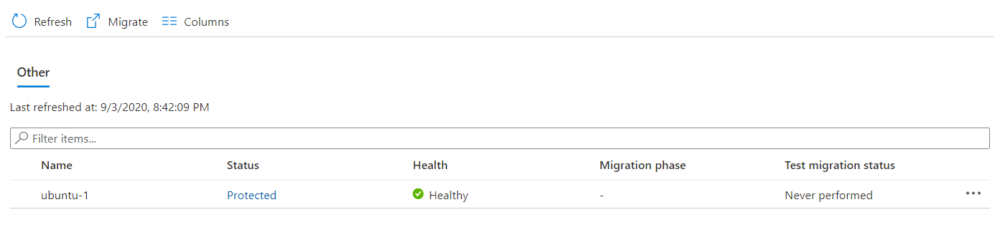

# Azure Migrate Demo Environment Setup
This article provides the instructions to set up a small enviroment to demonstrate Azure Migrate for Hyper-V VMs. The environment consists of two Ubuntu VMs running on an Azure VM supporting nested virtualization. Both server assessment and migration functions can be performed on this environment.

## 1. Create Hyper-V Host VM
- Create a Windows Server 2016 VM with size D2s_v3
- Enable the Hyper-V feature
- Create the NAT virtual network switch

Reference: [How to enable nested virtualization in an Azure VM](https://docs.microsoft.com/en-us/azure/virtual-machines/windows/nested-virtualization)

## 2. Create Hyper-V VMs for Migration
We will create two Ubuntu VMs for showing both server assessment and dependency map. Ubuntu server images can be downloaded [here](https://releases.ubuntu.com/18.04/).

- Install the first Ubuntu VM "ubuntu-1" in the Hyper-V Manager.
  - The VM settings include:
    - 1 processor
    - Dynamic memory (min 512 MB, max 1024 MB)
    - Networking uses the virtual switch "InternalNAT" created in the previous step
    - Enable Integration Service -> Guest Services
  - Configure the network interface as following:
    - Subnet=192.168.0.0/24, IP=192.168.0.10, Gateway=192.168.0.1, Name Server=8.8.8.8
  - Update the latest Linux Integration Service (without this, the Linux OS and IP may not be discovered by Azure Migrate)
    ```
    sudo apt-get update
    sudo apt-get install linux-azure
    ```
- Install the second Ubuntu VM "ubuntu-2" using the same VM settings
  - Configure the network interface in the same way, use IP=192.168.0.11
  - Install Web server
    ```
    sudo apt update
    sudo apt install apache2
    sudo ufw allow Apache
    sudo ufw enable
    ```
  - Update the latest Linux Integration Service
- On "ubuntu-1", create a cronjob to query the homepage on "ubuntu-2" regularly so the traffic will show in the service map. The following is a sample command:
  ```
  wget -o $HOME/job.log -O $HOME/ubuntu2.html http://192.168.0.11
  ```

## 3. Install Agents on Hyper-V VMs
Install the Log Analytics and Dependency Agent on both Ubuntu VMs
- Create a Log Analytics workspace, install the Service Map solution
- Follow the instructions under workspace's "Agents management" to install the Log Analytics agent
- Follow these [instructions](https://docs.microsoft.com/en-us/azure/azure-monitor/insights/vminsights-enable-hybrid#install-the-dependency-agent-on-linux) to install the Dependency agent

## 4. Install Azure Migrate Appliance on Hyper-V Host
On the Hyper-V host VM, install and register the Azure Migrate Application for Hyper-V:
- Download the run the PowerShell [script](https://docs.microsoft.com/en-us/azure/migrate/tutorial-prepare-hyper-v#run-the-script) to prepare the host
- Create the Azure Migrate project, go to "Assessment tools" -> "Discovered servers" -> Dependencies link, set up the Analytics Workspace
- In the Azure Migrate project, go to Server -> Assessment tools -> Discover, choose Hyper-V, follow the instructions to download the Azure Migrate appliance image (.VHD) and install the appliance
  - When importing the VM, set VM setting: 1 processor, dynamic memory (min 1024 MB, max 4096 MB), virtual switch "InternalNAT"
  - Connect to the VM, set IP to 192.168.0.100
  - Modify C:\Windows\System32\drivers\etc\hosts, add record:
    ```
    <Hyper-V Host IP>   <Hyper-V Host Name>
    ```
- Run the Appliance Config Manager, complete the registration. Add the Hyper-V host, validate and start discovery.

**Note: The appliance uses the Windows trial license that is valid for 180 days.**

## 5. Install Replication Provider on Hyper-V Host
In the Azure Migrate Project, go to "Migration tools" -> "Discover", download replication provider and key file, install on the Hyper-V host and register

## 6. Demo Screenshots
- Server Assessment

- Dependency

- Migration

