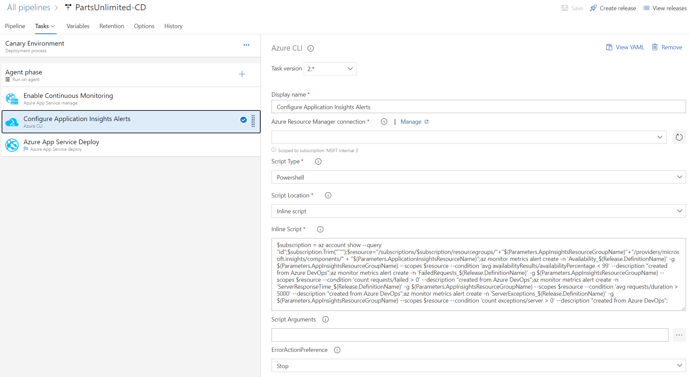
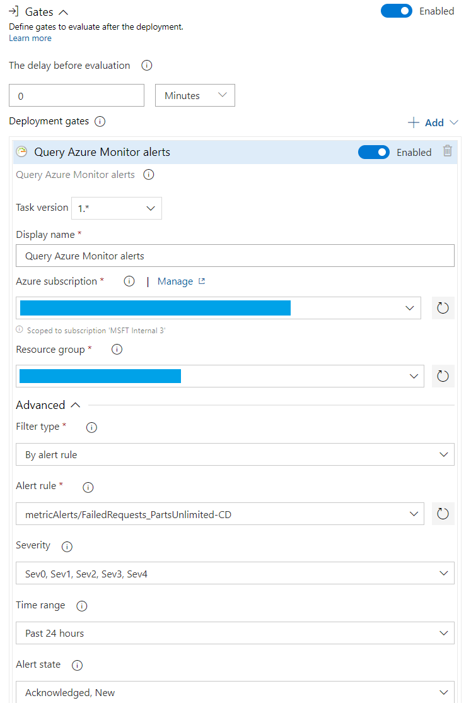

# Fix for AZ-400 Lab - Using Azure Monitor as Release Gate

The release pipeline for stage “Canary Environment” contains a deprecated task type “Azure Monitor Alerts task” and will not execute successfully. Follow the steps below to fix this issue:

1. Locate the release pipeline “PartsUnlimited-CD”, click “Edit”
2. Click the link “1 job, 3 tasks” in “Canary Environment”
3. Locate task “Configure Application Insights Alerts”, right-click -> Remove
4. Click “+” on “Agent phase” to create a new task, choose type “Azure CLI”, and drag the task to the 2nd in the task list
5. Change the task name to “Configure Application Insights Alerts” and configure it as in the following picture:

6. Set the Azure Resource Manager connection. Use the following Inline Script:
~~~~
$subscription = az account show --query "id";$subscription.Trim("`"");$resource="/subscriptions/$subscription/resourcegroups/"+"$(Parameters.AppInsightsResourceGroupName)"+"/providers/microsoft.insights/components/" + "$(Parameters.ApplicationInsightsResourceName)";az monitor metrics alert create -n 'Availability_$(Release.DefinitionName)' -g $(Parameters.AppInsightsResourceGroupName) --scopes $resource --condition 'avg availabilityResults/availabilityPercentage < 99' --description "created from Azure DevOps";az monitor metrics alert create -n 'FailedRequests_$(Release.DefinitionName)' -g $(Parameters.AppInsightsResourceGroupName) --scopes $resource --condition 'count requests/failed > 0' --description "created from Azure DevOps";az monitor metrics alert create -n 'ServerResponseTime_$(Release.DefinitionName)' -g $(Parameters.AppInsightsResourceGroupName) --scopes $resource --condition 'avg requests/duration > 5000' --description "created from Azure DevOps";az monitor metrics alert create -n 'ServerExceptions_$(Release.DefinitionName)' -g $(Parameters.AppInsightsResourceGroupName) --scopes $resource --condition 'count exceptions/server > 0' --description "created from Azure DevOps";
~~~~
7. Go back to the Pipeline diagram, click the “Post-deployment condition” (the human icon) of the “Canary Environment”
8. Enable “Query Azure Monitor alerts” gate, and configure as follows

9. Complete the other settings as in the lab instructions
