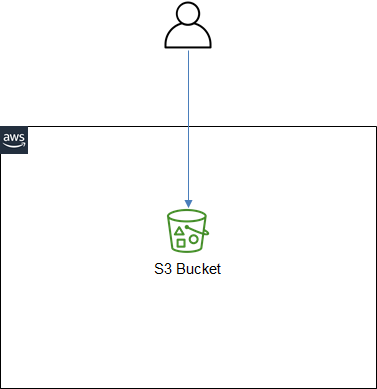

# ICT335 Virtual Lab 1: AWS & AWS Educate Overview, Build a Static Website with Simple Storage Service (S3)

## Lab Overview
In this lab, we will have an overview of the AWS Educate program and create the request to join as a student. We will create an AWS account and get familiar with the AWS Management Console. We will then create a static website using the Simple Storage Service (S3).

## Lab Task Outline
- Review [AWS Educate](https://aws.amazon.com/education/awseducate/)
- Join AWS Educate as Student
- Review [AWS Free Tier](https://aws.amazon.com/free/?all-free-tier.sort-by=item.additionalFields.SortRank&all-free-tier.sort-order=asc&awsf.Free%20Tier%20Types=*all) and [AWS Pricing](https://aws.amazon.com/pricing/?nc2=h_ql_pr_ln)
- Estimate cost with [AWS Pricing Calculator](https://calculator.aws/#/?nc2=h_ql_pr_calc_smc)
- [Create an AWS Account](https://portal.aws.amazon.com/gp/aws/developer/registration/index.html?nc2=h_ct&src=header_signup)
- Configure the account
  - Review __My Account__ settings
    - Set __Account Name__
    - Activate __IAM User and Role Access to Billing Information__
  - Review __My Security Credentials__
    - Enable __Multi-factor authentication (MFA)__
  - Review __My Billing Dashboard__ and the setting to __Receive AWS Free Tier Usage Alerts__ under __Billing preferences__
- Choose __IAM__ service, __Add user__
  - Select __AWS Management Console access__
  - Set permission by selecting existing policy: __AdministratorAccess__ 
- Select the newly created user, enable MFA under __Security credentials__
- Sign out and sign in using the newly created IAM user account
- Build a static website with Simple Storage Service (S3). The architecture is illustrated in the following picture.

  - Choose __S3__ service, __Create bucket__
  - Select the newly created bucket, enable __Static website hosting__ in __Properties__ tab
    - Enter `index.html` for __Index document__ and `error.html` for __Error document__
  - Download the [zip file](http://tinyurl.com/s3static) containing the static website files, unzip, and __Upload__ the two files to the bucket
  - Select object *index.html*, try to access the static website using __Object URL__, observe the access error
  - Enable public access
    - Review __Account settings for Block Public Access__
    - Uncheck __Block all public access__ in bucket's __Permission__ tab
    - In bucket's __Objects__ tab, select both objects, click __Action__ and select __Make public__
    - Review the ACL settings in each object's __Details__ tab
  - Try to access the static website again, the webpage displays successfully

## Lab Cleanup
- Delete all the objects in the S3 bucket
- Keep the bucket for the future labs
