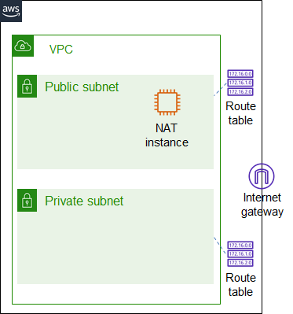
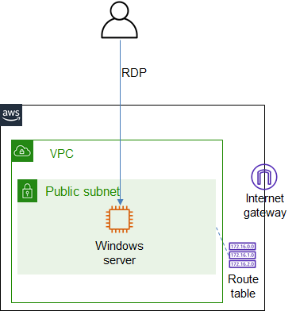

# ICT335 Virtual Lab 2: Build a Virtual Private Cloud (VPC) and Elastic Compute Cloud (EC2) Instance

## Lab Overview
In this lab, we will create a Virtual Private Cloud (VPC) and review its configuration. We will then create a Windows server using the Elastic Compute Cloud (EC2) instance and RDP into it.

## Lab Task Outline
- Build a Virtual Private Cloud (VPC). The architecture is illustrated in the following diagram.

  - Choose __VPC__ service, __Launch VPC Wizard__
    - Select __VPC with Public and Private Subnets__
    - Enter the VPC name
    - Select __Use a NAT instance instead__ and choose instance type __t2.micro__
    - Create VPC
  - Review the newly created VPC and its configuration
    - Review the two subnets and their associated route tables
    - Review the routes in the route tables, and the route targets
  - Clean up
    - Choose __EC2__ service, select the Elastic IP resource and release it
    - Terminate the EC2 instance

- Build a Windows server. The architecture is illustrated in the following diagram.  

  - Choose __VPC__ service, __Launch VPC Wizard__
    - Select __VPC with a Single Public Subnet__
    - Enter the VPC name and create VPC
  - Choose __EC2__ service, __Launch instance__
    - Search "windows server 2019", select "Microsoft Windows Server 2019 Base"
    - Select __t2.micro__
    - Select the VPC created in the previous step
    - Enable __Auto-assign Public IP__
    - __Launch__
    - When prompted, __Create a new key pair__, enter a name, __Download Key Pair__
    - __Launch instances__
  - Select the newly created EC2 instance, __Connect__
  - Choose __RDP client__ and select __Get password__. Click __Browse__ and select the key file downloaded in the previous step. __Decrypt Password__ and note down the password
  - __Download remote desktop file__, open it and login when prompted

## Lab Cleanup
- Terminate the EC2 instance
- Delete the security group and key pair
- Keep the VPC for the future labs
