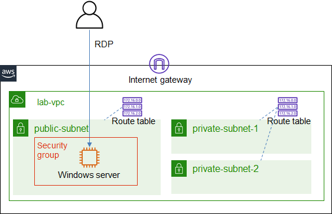

# ICT335 Virtual Lab 2: Build a Virtual Private Cloud (VPC) and Elastic Compute Cloud (EC2) Instance

## Lab Overview
In this lab, we will create a Virtual Private Cloud (VPC) and review its configuration. We will then create a Windows server using the Elastic Compute Cloud (EC2) instance and RDP into it.

## Lab Task Outline
### 1. Build a Virtual Private Cloud (VPC)
The architecture is illustrated in the following diagram.  

  - Choose __VPC__ service, __Launch VPC Wizard__
    - Select __VPC with a Single Public Subnet__, enter the following attribute values:
      - VPC name: `lab-vpc`
      - Availability Zone: `ap-southeast-1a`
      - Subnet name: `public-subnet`
    - Create VPC
  - In the subnet list, choose *public-subnet*, click __Actions__, and __Modify auto-assign IP settings__, __Enable auto-assign public IPv4 address__
  - Create two more subnets
    - Subnet name: `private-subnet-1`, Availability Zone: `ap-southeast-1b`, IPv4 CIDR block: `10.0.1.0/24`
    - Subnet name: `private-subnet-2`, Availability Zone: `ap-southeast-1c`, IPv4 CIDR block: `10.0.2.0/24`
  - Review the newly created VPC and its configuration
    - Review the three subnets and their associated route tables
    - Review the routes in the route tables, and the route targets

### 2. Build a Windows Server
  - Choose __EC2__ service, __Create security group__, with the name of `labvm-sg`. Provide a description, choose VPC: *lab-vpc*. Add the following inboud rules:
    - Type: __SSH__, Source: __Anywhere__
    - Type: __RDP__, Source: __Anywhere__
    - Type: __Custom TCP__, Port range: `8080`, Source: __Anywhere__
  - Choose __EC2__ service, __Launch instance__
    - Search "windows server 2019", select __Microsoft Windows Server 2019 Base__
    - Select __t2.micro__
    - Select VPC: *lab-vpc*, subnet: *public-subnet*
    - Select the existing security group: *labvm-sg*
    - __Launch__
    - When prompted, __Create a new key pair__ with the name of `labvm-key`, __Download Key Pair__
    - __Launch instances__
  - Select the newly created EC2 instance, __Connect__
  - Choose __RDP client__ and select __Get password__. Click __Browse__ and select the key file downloaded in the previous step. __Decrypt Password__ and note down the password
  - __Download remote desktop file__, open it and login when prompted

## Lab Cleanup
- Terminate the EC2 instance
- Keep the VPC, security group and key pair for the next lab
