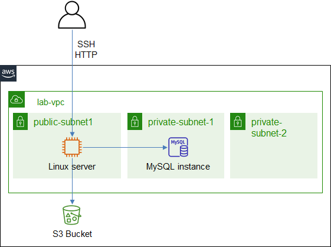

# ICT335 Virtual Lab 3: Build a Web Application with EC2 and Relational Database Service (RDS) MySQL

## Lab Overview
In this lab, we will create a Web Application that runs on an EC2 instance and connects to a database using Relational Database Service (RDS) MySQL.

This lab will reuse the VPC and S3 bucket from the previous labs.

The architecture is illustrated in the following diagram.  

## Lab Task Outline
### 1. Delete unused public subnets
- Choose __VPC__ service, __Subnets__, sort the table by __VPC__ column
- Check *lab-subnet-public2-us-east-1b* and *lab-subnet-public3-us-east-1c*
- Under __Actions__ menu, choose __Delete subnet__
- Ignore the error message, confirm deletion, click __Delete__

### 2. Create RDS MySQL Database
- Choose __RDS__ service, __Create DB Subnet Group__ with name `lab-vpc-subnet-group`. Provide a description.
  - VPC: *lab-vpc*
  - Availability zones: *us-east-1b*, *us-east-1c*
  - Subnets: the two private subnets created in the previous lab
- __Create database__, with the following attributes:
  - *Standard create*
  - *MySQL*, default version: *8.0.23*
  - *Free tier*
  - DB instance ID: `database-1`
  - Master username and password: `admin` / \<MYSQL_PASSWORD\>
  - Storage
    - Allocated storage: `5` GB
    - Disable __Storage autoscaling__
  - Connectivity
    - VPC: *lab-vpc*
    - Subnet group: *lab-vpc-subnet-group*
    - Public access: *No*
    - VPC security group: *default*
  - Password authentication
  - Additional configuration: disable backup
- After the database is created, enable incoming MySQL traffic
  - Choose *database-1*, choose the Security group, edit inbound rules, add the following rule:
    - Type: *MYSQL/Aurora*, Source: *Anywhere-IPv4*
- Take note of the database endpoint host string, which will be used to replace \<MYSQL_HOST\> in task 3

### 3. Upload Web Application Package to S3
- Upload [azure-vote.tar](https://github.com/ningweinw/ningweinw.github.io/raw/master/ICT335/scripts/azure-vote.tar) to the S3 bucket created in Lab 1.
  - Provide the following tag: key=*public*, value=*yes*
- Take note of the URL, which will be used to replace <S3_TAR_URL> in task 3

### 4. Create EC2 Launch template for Web Server
- Choose __EC2__ service, __Create launch template__ with name `lab-ubuntu-template`. Select the following attributes:
  - Enable __Auto Scaling guidance__
  - Image: *Ubuntu Server 18.04 LTS*
  - Instance type: *t2.micro*
  - Key pair: *labvm-key*
  - Security group: *labvm-sg*
  - In __Advanced details__, provide the [user data](https://github.com/ningweinw/ningweinw.github.io/raw/master/ICT335/scripts/ec2-userdata.txt) (Replace \<S3_TAR_URL\>, \<MYSQL_PASSWORD\>, \<MYSQL_HOST\> with the values from the previous steps)

### 5. Create Web Server
- Choose the launch template. From __Actions__, __Launch instance from template__
  - In __Network settings__, choose *lab-subnet-public1-us-east-1a*
- Take note of EC2 instance' __Public IPv4 DNS__
- Open a browser, connect to `http://<EC2_DNS_Name>:8080`

## Lab Cleanup
- Terminate the EC2 instance
- Keep the database, EC2 launch template and S3 object for the next lab
- Stop the database
