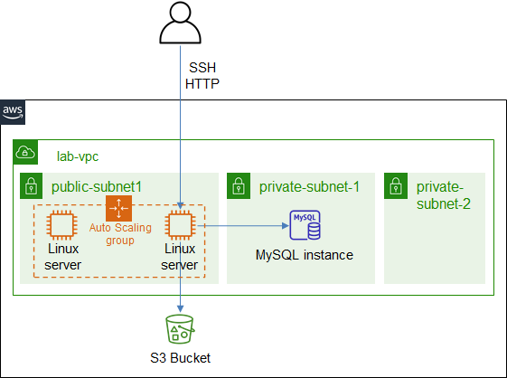

# ICT335 Virtual Lab 4: Build a Web Application with EC2 Auto Scaling

## Lab Overview
In this lab, we will create a Web Application with EC2 Auto Scaling Group.

This lab will reuse the VPC, S3 bucket and EC2 launch template from the previous labs.

The architecture is illustrated in the following diagram.  


## Lab Task Outline
### 1. Create EC2 Auto Scaling Group
- Choose __EC2__ service, __Auto Scaling Groups__, __Create an Auto Scaling Group__ with name `lab-asp`, and the following setting:
  - Launch template: *lab-ubuntu-template*
  - Click __Next__, select __Adhere to launch template__
  - VPC: *lab-vpc*, subnet: *public-subnet*
  - Click __Next__, select __No load balancer__, check __Enable group metrics collection within CloudWatch__
  - Click __Next__, select __None__ for scaling policies
  - Click __Next__ all the way, and click __Create Auto Scaling group__
- Choose the newly created auto scaling group *lab-asp*, edit __Advanced configurations__, change __Default cooldown__ to `60` seconds
- In __Instance management__, one instance is displayed, get its __Public IPv4 DNS__, verify the web application is working using URL: http://<EC2_DNS_Name>:8080

### 2. Manual Scaling
- Choose __EC2__ service, choose auto scaling group *lab-asp*
- Edit __Group details__, set the following attributes:
  - Desired capacity: `2`
  - Maximum capacity: `2`
- In __Instance management__, observe a new instance is created, verify the web application is working
- Edit __Group details__, set the following attributes:
  - Desired capacity: `1`
- In __Instance management__, observe an instance is terminated and removed from the auto scaling group

### 3. Auto Scaling
- Choose __EC2__ service, choose auto scaling group *lab-asp*
- In __Automatic scaling__, __Add policy__ with the following setting:
  - Policy type: __Target tracking scaling__
  - Metric type: *Average CPU utilization*
  - Target value: `50`
  - Instance warm up: `60` seconds
- Simulate CPU load. SSH to the only instance, run the following command from where the downloaded key file *labvm-key.pem* is located
  ```
  ssh -i labvm-key.pem ubuntu@<EC2_DNS_Name>  
  stress --cpu 1 --timeout 300 &  
  ```
- Observe the __CPU Utilization graph__ in __Monitoring__, __EC2__ tab
- After around 5 minutes, a new instance is created, observe the __Activity history__
- As the simulated CPU load has stopped, observe the change in __CPU Utilization graph__
- After a few more minutes (can be more than 10 minutes), automatic scale-in takes place, one instance is removed

## Lab Cleanup
- Delete the auto scaling group
