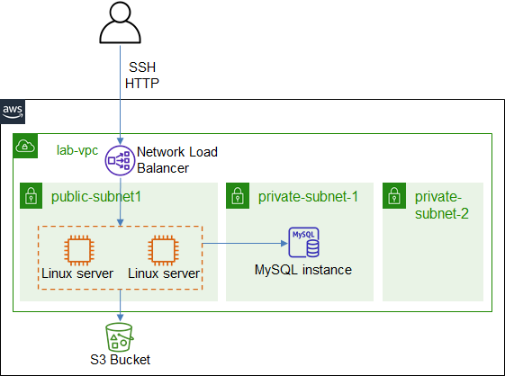

# ICT335 Virtual Lab 5: Build a Load Balanced Web Application with Elastic Load Balancing

## Lab Overview
In this lab, we will create a load balanced Web Application with Elastic Network Load Balancer

This lab will reuse the VPC, EC2 launch template and MySQL database from the previous labs.

The architecture is illustrated in the following diagram.  

## Lab Task Outline
### 1. Preparation
- Start the database

### 2. Create Two Web Servers
- Choose __EC2__ service, __Launch template__, select *lab-ubuntu-template*
- __Actions__, __Launch instance from template__ with the following settings:
  - Number of instances: `2`
  - Network settings: choose *public-subnet*
- Two EC2 instances are created
- For each instance, verify the web application URL works: `http://<EC2_DNS_Name>:8080`

### 3. Create Network Load Balancer
- Choose __Load Balancers__, __Create Load Balancer__, select __Network Load Balancer__
  - Name: `lab-lb`
  - Scheme: *internet-facing*
  - Network mapping: select *lab-vpc* and *us-east-1a*, the *public-subnet* will be selected automatically
  - Listeners: keep the default listener on TCP port 80
  - Click __Create target group__
    - New target group: `lab-lb-tg`
    - Port: `8080`
    - Advanced health check settings: change interval to *10 seconds*
    - __Next: Register Targets__. Choose both instances, __Include as pending below__
    - __Create target group__
  - Back in the load balancer creation wizard, click the refresh button next to the target group list, select the newly created target group
  - __Create load balancer__
- After *lab-lb* is created, in the __Listeners__ tab, click the target group *lab-lb-tg*
  - In the __Targets__ tab, wait for both instances to show *healthy* status
- Back to the load balancer *lab-lb*, find the DNS, visit the URL `http://<LB_DNS>` and the web application homepage is displayed
- Refresh the URL a few times, observe the host name display
- Stop one EC2 instance, refresh the load balancer URL, observe the result. Notice the delay before the stopped instance is removed from the traffic forwarding.

## Lab Cleanup
- Delete the load balancer and target group
- Terminate the EC2 instances
- Stop the database
