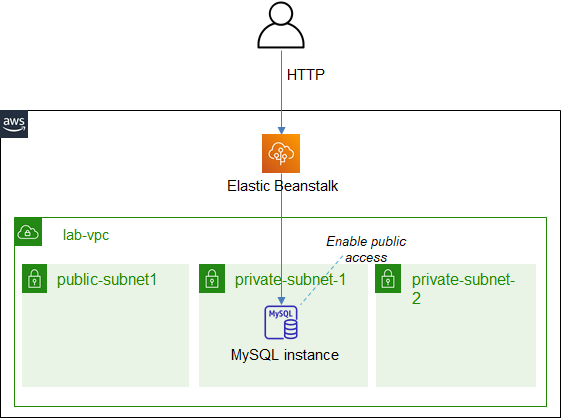

# ICT335 Virtual Lab 6: Build a Web Application with Elastic Beanstalk

## Lab Overview
In this lab, we will create a Web Application with Elastic Beanstalk.

This lab will reuse the VPC and MySQL database from the previous labs.

The architecture is illustrated in the following diagram.  


## Lab Task Outline
### 1. Prepare MySQL to Allow Public Access
The MySQL database created in lab 3 only allows private access in VPC, we need to reconfigure it to allow public access from free tier Beanstalk application.
- Choose __RDS__, select *database-1*, start it
  - __Modify__, in __Connectivity__, select __Additional configuration__. Enable __Publicly accessible__, __Continue__, and complete the modification (Choose __Continue__, then __Modify DB instance__)
- Choose __VPC__, in __Route Tables__, perform the following configuration for both *lab-rtb-private2-us-east-1b* and *lab-rtb-private3-us-east-1c*
  - __Edit routes__, __Add route__ with the following attributes, __Save changes__
    - Destination: `0.0.0.0/0`
    - Target: *Internet Gateway*, choose the only record

### 2. Create a Traffic Simulation Server
- Choose __EC2__, click __Launch instance__, select __Launch instance from template__
  - Select *lab-ubuntu-template*
  - In __Network settings__, choose *lab-subnet-public1-us-east-1a*
- Click __Launch instance__
- Take note of EC2 instance' __Public IPv4 DNS__
- Wait for the EC2 instance' status check to display "2/2 checks passed"
- On laptop, launch the command prompt, change the directory to where `labvm-key.pem` is stored
- Run the following command to connect to the EC2 instance:
```
ssh -i "labvm-key.pem" ubuntu@<EC2 Public IP or DNS>
```
- On the EC2 instance, run following commands (If a prompt is shown to restart services, use Tab key to choose Cancel and press Enter):
```
sudo apt-get update
sudo apt-get install apache2-utils
ab -h
```

### 3. Build the Web Application Package
- The web application package [eb-azurevote.zip](https://github.com/ningweinw/ningweinw.github.io/raw/master/ICT335/scripts/eb-azurevote.zip) for Elastic Beanstalk has been provided

### 4. Deploy the Web Application
- Choose __Elastic Beanstalk__, __Create Application__ with the name: `lab-eb`
- __Platform__: *Python*
- __Platform branch__: *Python 3.13 running on 64bit Amazon Linux 2023*
- __Upload your code__: select *Local file* and upload the *eb-azurevote.zip* downloaded in task 2
- __Version label__: *v1*
- __Presets__: select *High availability*
- Click __Next__. In step __Configure service access__
  - For Service role, choose *LabRole*
  - If the environment is in the us-east-1 AWS Region, for EC2 key pair, choose *vockey*
  - For EC2 instance profile, choose *LabInstanceProfile*
- Click __Next__ three times. In step __Configure updates, monitoring, and logging__
  - In the __Platform software__ section, under __Environment properties__, add the following items
    - `MYSQL_USER` = `admin`
    - `MYSQL_PASSWORD` = \<MYSQL_PASSWORD\>
    - `MYSQL_HOST` = \<MYSQL_HOST\>
- Click __Next__, review all the configuration and __Create__
- The Elastic Beanstalk application and environment will be created. When the environment *Lab-eb-env* is ready, click the link under __Domain__, the web application will display.
- Right-click __Domain__, select __Copy link__, paste the value in a notepad or text file
- Observe the resources that have been created automatically including the EC2, Security Group, Load Balancer, Target Group

### 5. Update the Auto Scaling Settings
- Choose environment *Lab-eb-env*, __Configuration__, click __Edit__ in the __Instance traffic and scaling__ section. Update the following settings, under Scaling triggers, to reduce the waiting time for auto scaling
  - Period: `1` Min
  - Breach duration: `1` Min
  - Upper threshold: `5000` Bytes
  - Lower threshold: `1000` Bytes
- __Apply__

### 6. Simulate Web Traffic
On the Traffic Simulation server, run the following command:
```
ab -c 2 -n 1000000 <Environment URL from Step 5>
```

### 7. Observe Auto Scaling
- Wait for 5 minutes, choose environment *Labeb-env*, __Health__, observe the number of EC2 instances
- Choose __Event__, observe the event records
- Choose __Monitoring__, observe the metrics

## Lab Cleanup
- Delete the traffic simulation EC2 instance
- Delete the Beanstalk application
- Delete the database
